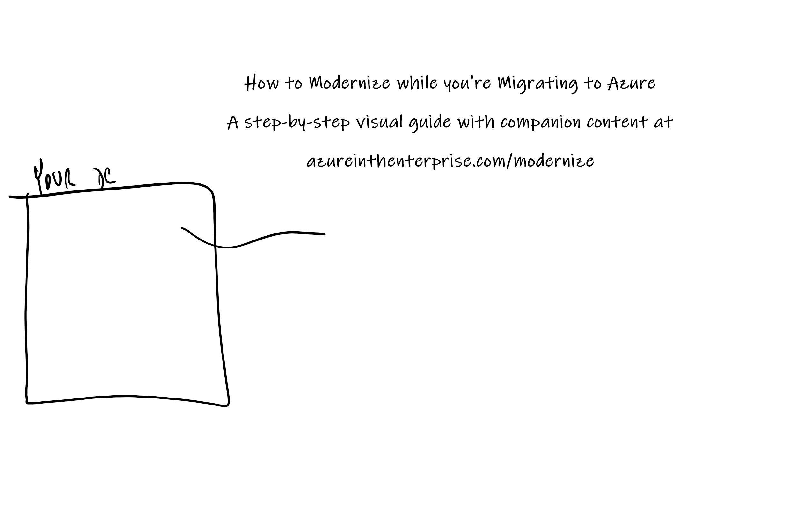

# Modernizing while Migrating to Azure

This is my playground for drawing out in Microsoft Whiteboard how a customer can *modernize* while they're moving to Azure.

Links in the drawing:

- [1 - The five Rs of rationalization](/go/azure/five-rs)
- [2 - Rehost](https://docs.microsoft.com/azure/cloud-adoption-framework/digital-estate/5-rs-of-rationalization?wt.mc_id=azureintheenterprise.com#rehost)
- [3 - Refactor](https://docs.microsoft.com/azure/cloud-adoption-framework/digital-estate/5-rs-of-rationalization?wt.mc_id=azureintheenterprise.com#refactor)
- [4 - Rearchitect](https://docs.microsoft.com/azure/cloud-adoption-framework/digital-estate/5-rs-of-rationalization?wt.mc_id=azureintheenterprise.com#replace)
- [5 - Rebuild](https://docs.microsoft.com/azure/cloud-adoption-framework/digital-estate/5-rs-of-rationalization?wt.mc_id=azureintheenterprise.com#replace)
- [6 - Replace](https://docs.microsoft.com/azure/cloud-adoption-framework/digital-estate/5-rs-of-rationalization?wt.mc_id=azureintheenterprise.com#replace)
